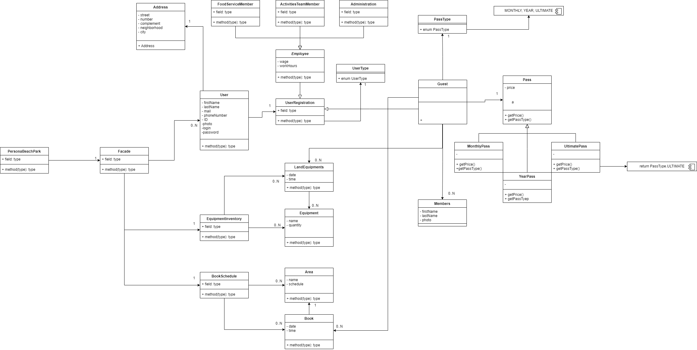

# PersonaBeachPark

Just a little project to improve my knowledge in OOP, DB, HTML and CSS and finaly some design patterns.

Persona Beach Park is a brand-new themed park that will be located in Alfenas-MG, the perfect option to spend time with friends and family. The park will work with monthly pass, year pass and an ultimate pass, all this passes will have the option to add family members. The park will offer activities apart from the pools, such as exercises, sports, and even parties. 

## Everything I did so far

### 11/19/2022

Started the day defining the actors and the actions and doing some user's stories. Also did the first version of the class diagram, nothing fancy, just a simple one to have an idea of the interactions.

#### UML Class Diagram

  

 

