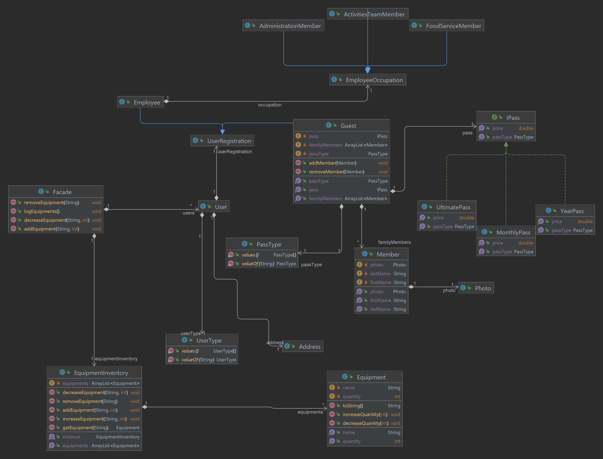
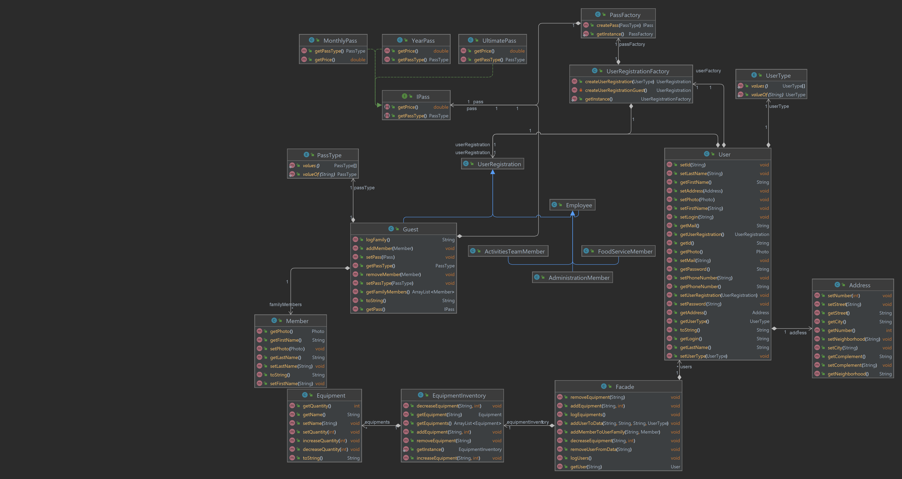

# PersonaBeachPark

Just a little project to improve my knowledge in OOP, DB, HTML and CSS and finaly some design patterns.

Persona Beach Park is a brand-new themed park that will be located in Alfenas-MG, the perfect option to spend time with friends and family. The park will work with monthly pass, year pass and an ultimate pass, all this passes will have the option to add family members. The park will offer activities apart from the pools, such as exercises, sports, and even parties. 

## Everything I did so far

### 11/19/2022

Started the day defining the actors and the actions and doing some user's stories. Also did the first version of the class diagram, nothing fancy, just a simple one to have an idea of the interactions.

#### UML Class Diagram

  

### 11/20/2022

Started the java project based on the class diagram, did some business logic related to the equipments inventory (add, remove, increase and decrease). Having some trouble to figure out where the exclusive methods should be, my idea was to create the methods inside the users, like in ActivitiesTeamMember methods like land equipment and organize events. I don’t know if this is a good option, once I will need to do a lot of instance checking and casting.

#### UML Class Diagram

  

 
### 11/21/2022

Since I had those state patterns, I decided to implement factories to create new users with their states. Spotted some problems with the methods inside Guest that I will change in the future (change methods parameters from Member to Name (first + last), since a member can’t have the same name). 

#### UML Class Diagram

  

